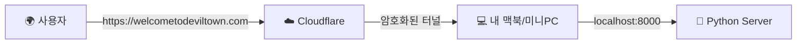

# Cloudflare 도메인 연결 및 배포 가이드

## 📋 목차
1. [보안 최종 점검](#보안-최종-점검)
2. [GitHub 푸시](#github-푸시)
3. [Cloudflare 도메인 구매](#cloudflare-도메인-구매)
4. [서버 배포 (VPS/Cloud)](#서버-배포)
5. [Cloudflare DNS 설정](#cloudflare-dns-설정)
6. [SSL/HTTPS 설정](#sslhttps-설정)
7. [환경 변수 설정](#환경-변수-설정)
8. [최종 테스트](#최종-테스트)

---

## 🔒 보안 최종 점검

### ✅ 점검 완료 항목

1. **API 키 보호**
   - ✅ `.env` 파일에만 존재
   - ✅ `.gitignore`에 `.env` 포함
   - ✅ 코드에 하드코딩된 API 키 없음
   - ✅ 문서에 실제 API 키 없음

2. **민감한 파일**
   ```bash
   # .gitignore 확인
   .env
   __pycache__/
   *.pyc
   *.pyo
   *.pyd
   .Python
   *.so
   *.egg
   *.egg-info/
   dist/
   build/
   ```

3. **Git 저장소 확인**
   ```bash
   # .env가 Git에 추가되지 않았는지 확인
   git ls-files | grep .env
   # 결과: 없음 (정상)
   ```

---

## 📤 GitHub 푸시

### 1. 원격 저장소 연결
```bash
cd "/Users/chaehyeonbyeongsin/Desktop/코딩/데빌타운 웹사이트"

# 원격 저장소 추가
git remote add origin https://github.com/howcanimakeprogram/built_deviltown.git

# 또는 이미 있다면 URL 변경
git remote set-url origin https://github.com/howcanimakeprogram/built_deviltown.git
```

### 2. 푸시
```bash
# main 브랜치로 푸시
git branch -M main
git push -u origin main
```

### 3. GitHub에서 확인
- https://github.com/howcanimakeprogram/built_deviltown
- `.env` 파일이 없는지 확인 ✅
- README.md가 잘 표시되는지 확인

---

## 🌐 Cloudflare 도메인 구매

### 1. Cloudflare 계정 생성
1. https://dash.cloudflare.com/sign-up 접속
2. 이메일 + 비밀번호로 가입
3. 이메일 인증

### 2. 도메인 구매
1. **Cloudflare Dashboard** → **Domain Registration** 클릭
2. 원하는 도메인 검색 (예: `deviltown.run`, `deviltown.club`)
3. 가격 확인 (.com: ~$10/년, .run: ~$3/년, .club: ~$13/년)
4. **Purchase** 클릭
5. 결제 정보 입력 (카드 또는 PayPal)
6. 구매 완료

**추천 도메인**:
- `deviltown.run` - 러닝 관련, 저렴
- `deviltown.club` - 커뮤니티 느낌
- `deviltown.coach` - 코치 컨셉

### 3. 도메인 활성화 확인
- 구매 후 5-10분 대기
- **DNS** 탭에서 도메인 확인

---

## 🖥️ 서버 배포 (VPS/Cloud)

### 옵션 1: DigitalOcean (추천)

#### 1. Droplet 생성
```bash
# 1. DigitalOcean 가입: https://www.digitalocean.com/
# 2. Create → Droplets
# 3. 선택:
#    - Ubuntu 22.04 LTS
#    - Basic Plan: $6/month (1GB RAM)
#    - Region: Singapore (한국과 가까움)
#    - SSH Key 추가
```

#### 2. 서버 접속
```bash
ssh root@your_server_ip
```

#### 3. 서버 설정
```bash
# 시스템 업데이트
apt update && apt upgrade -y

# Python 설치
apt install python3 python3-pip python3-venv -y

# Nginx 설치 (리버스 프록시)
apt install nginx -y

# Git 설치
apt install git -y
```

#### 4. 프로젝트 클론
```bash
cd /var/www
git clone https://github.com/howcanimakeprogram/built_deviltown.git
cd built_deviltown
```

#### 5. Python 환경 설정
```bash
# 가상환경 생성
python3 -m venv venv
source venv/bin/activate

# 의존성 설치
pip install -r requirements.txt
```

#### 6. 환경 변수 설정
```bash
# .env 파일 생성
nano .env
```

내용:
```env
GOOGLE_API_KEY=your_actual_api_key_here
```

저장: `Ctrl+X` → `Y` → `Enter`

#### 7. Systemd 서비스 생성
```bash
nano /etc/systemd/system/deviltown.service
```

내용:
```ini
[Unit]
Description=Devil Town Running Coach
After=network.target

[Service]
Type=simple
User=root
WorkingDirectory=/var/www/built_deviltown
Environment="PATH=/var/www/built_deviltown/venv/bin"
ExecStart=/var/www/built_deviltown/venv/bin/python main.py
Restart=always

[Install]
WantedBy=multi-user.target
```

#### 8. 서비스 시작
```bash
systemctl daemon-reload
systemctl start deviltown
systemctl enable deviltown
systemctl status deviltown
```

---

### 옵션 2: Cloudflare Pages (정적 사이트만)

> ⚠️ **주의**: Cloudflare Pages는 정적 사이트만 지원하므로 FastAPI 백엔드는 별도 서버 필요

---

## 🔧 Cloudflare DNS 설정

### 1. DNS 레코드 추가

Cloudflare Dashboard → 도메인 선택 → **DNS** → **Records**

#### A 레코드 (서버 IP 연결)
```
Type: A
Name: @
IPv4 address: your_server_ip
Proxy status: Proxied (주황색 구름)
TTL: Auto
```

# Devil Town 홈 서버 배포 가이드 (MacBook/Mac Mini)

## 📋 개요
이 가이드는 **집에 있는 Mac**을 서버로 사용하여 전 세계에 웹사이트를 배포하는 방법을 설명합니다.
**Cloudflare Tunnel**을 사용하므로, 복잡한 공유기 설정(포트포워딩)이나 고정 IP가 필요 없습니다.

---

## 🏗️ 아키텍처


---

## 🚀 1. 준비물
- 항상 켜둘 수 있는 **Mac** (맥북, 맥미니 등)
- 도메인 (예: `welcometodeviltown.com`)
- Cloudflare 계정

---

## 🛠️ 2. 서버 실행 (Python)

서버는 항상 켜져 있어야 합니다. 터미널을 열고 실행하세요.

```bash
# 프로젝트 폴더로 이동
cd "/Users/chaehyeonbyeongsin/Desktop/코딩/데빌타운 웹사이트"

# 서버 실행 (백그라운드 유지 추천)
python main.py
```

> **팁**: 터미널을 꺼도 실행되게 하려면 `nohup`을 사용하세요.
> ```bash
> nohup python main.py > server.log 2>&1 &
> ```

---

## 🚇 3. 외부 연결 (Cloudflare Tunnel)

### 3-1. 설치
```bash
brew install cloudflared
```

### 3-2. 로그인 & 터널 생성
```bash
# 로그인 (브라우저 인증)
cloudflared tunnel login

# 터널 생성 (이름: deviltown)
cloudflared tunnel create deviltown
```

### 3-3. 설정 파일 생성
`~/.cloudflared/config.yml` 파일을 생성하고 아래 내용을 붙여넣으세요.
(단, `credentials-file` 경로는 실제 생성된 JSON 파일 경로로 수정!)

```yaml
tunnel: deviltown
credentials-file: /Users/chaehyeonbyeongsin/.cloudflared/[UUID].json

ingress:
  - hostname: welcometodeviltown.com
    service: http://localhost:8000
  - hostname: www.welcometodeviltown.com
    service: http://localhost:8000
  - service: http_status:404
```

### 3-4. 도메인 연결 & 실행
```bash
# 도메인 연결 (DNS)
cloudflared tunnel route dns deviltown welcometodeviltown.com
cloudflared tunnel route dns deviltown www.welcometodeviltown.com

# 터널 실행
cloudflared tunnel run deviltown
```

---

## ⚡ 4. 맥북 절전 방지 (필수!)
맥북 덮개를 닫거나 잠자기 모드로 들어가면 서버가 끊깁니다.
1. **설정** > **디스플레이** > **고급** > **"디스플레이가 꺼져도 잠들지 않음"** 켜기
2. 또는무료 앱 **Amphetamine** 설치 후 "Indefinitely" 실행

---

## 🔄 5. 자동 실행 (재부팅 시)
맥을 재부팅해도 자동으로 켜지게 하려면 서비스를 등록하세요.

```bash
cloudflared service install
launchctl start com.cloudflare.cloudflared
```

---

## ✅ 체크리스트
- [ ] `python main.py` 실행 중인가?
- [ ] `cloudflared tunnel run` 실행 중인가?
- [ ] 도메인(`welcometodeviltown.com`) 접속 시 잘 열리는가?


### 2. Cloudflare Origin Certificate 생성

1. Cloudflare Dashboard → **SSL/TLS** → **Origin Server**
2. **Create Certificate** 클릭
4. 인증서 복사:

```bash
# 인증서 저장
mkdir -p /etc/ssl/cloudflare
nano /etc/ssl/cloudflare/cert.pem
# (인증서 내용 붙여넣기)

# 키 저장
nano /etc/ssl/cloudflare/key.pem
# (키 내용 붙여넣기)

chmod 600 /etc/ssl/cloudflare/*
```

### 3. Nginx 활성화
```bash
ln -s /etc/nginx/sites-available/deviltown /etc/nginx/sites-enabled/
nginx -t
systemctl reload nginx
```

---

## 🌍 환경 변수 설정 (프로덕션)

### main.py 수정 (CORS)
```python
# 프로덕션용 CORS 설정
app.add_middleware(
    CORSMiddleware,
    allow_origins=[
        "https://deviltown.run",
        "https://www.deviltown.run"
    ],
    allow_credentials=True,
    allow_methods=["*"],
    allow_headers=["*"],
)
```

### 서버 재시작
```bash
systemctl restart deviltown
```

---

## ✅ 최종 테스트

### 1. DNS 전파 확인
```bash
# 로컬에서 확인
nslookup deviltown.run

# 또는
dig deviltown.run
```

### 2. HTTPS 접속 테스트
1. 브라우저에서 `https://deviltown.run` 접속
2. 자물쇠 아이콘 확인 (SSL 정상)
3. 메뉴 → Skull Game 테스트
4. 메뉴 → Devil Coach AI 테스트

### 3. API 테스트
```bash
curl -X POST https://deviltown.run/chat \
  -H "Content-Type: application/json" \
  -d '{"message": "안녕", "history": []}'
```

---

## 🚀 배포 체크리스트

### GitHub
- [ ] `.env` 파일이 Git에 없는지 확인
- [ ] README.md 업데이트
- [ ] 코드 푸시 완료

### Cloudflare
- [ ] 도메인 구매 완료
- [ ] DNS A 레코드 추가
- [ ] SSL/TLS Full (strict) 설정
- [ ] Origin Certificate 생성

### 서버
- [ ] VPS 생성 (DigitalOcean 등)
- [ ] Python + Nginx 설치
- [ ] 프로젝트 클론
- [ ] .env 파일 생성 (API 키)
- [ ] Systemd 서비스 등록
- [ ] Nginx 설정
- [ ] 방화벽 설정 (80, 443 포트)

### 테스트
- [ ] HTTPS 접속 확인
- [ ] Skull Game 작동 확인
- [ ] Devil Coach AI 작동 확인
- [ ] 모바일 반응형 확인

---

## 💡 추가 최적화

### 1. Cloudflare 캐싱
**Caching** → **Configuration**
- Caching Level: **Standard**
- Browser Cache TTL: **4 hours**

### 2. Cloudflare 성능 최적화
**Speed** → **Optimization**
- Auto Minify: HTML, CSS, JS 모두 체크
- Brotli: 활성화
- Early Hints: 활성화

### 3. 모니터링
- Cloudflare Analytics 확인
- 서버 로그 모니터링: `journalctl -u deviltown -f`

---

## 🆘 트러블슈팅

### 문제 1: 502 Bad Gateway
```bash
# 서비스 상태 확인
systemctl status deviltown

# 로그 확인
journalctl -u deviltown -n 50
```

### 문제 2: DNS 전파 안 됨
- 24-48시간 대기 (보통 10분 이내)
- Cloudflare DNS 설정 재확인

### 문제 3: SSL 인증서 오류
- Cloudflare SSL/TLS 모드 확인 (Full strict)
- Origin Certificate 재생성

---

**Happy Deploying! 🚀**
