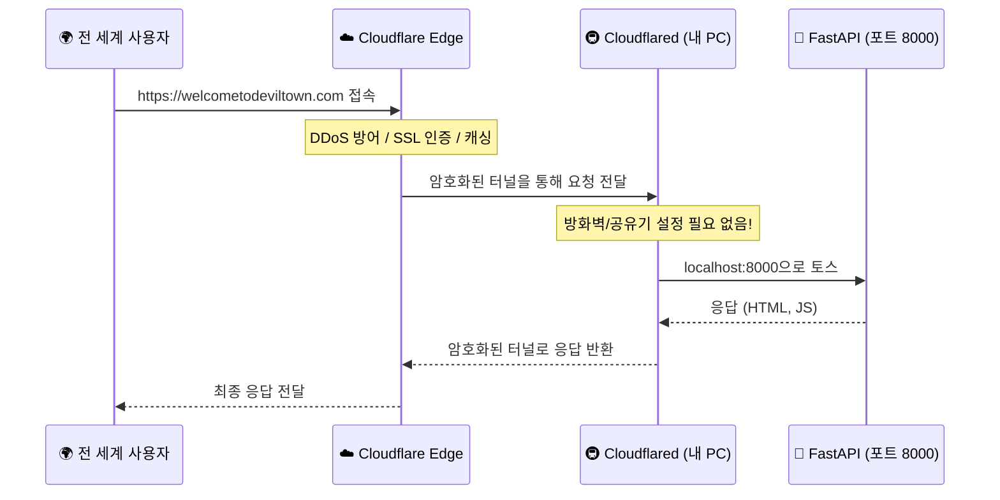

# MAINTENANCE.md - Devil Town 웹사이트 유지보수 가이드

## 📦 의존성 목록 및 버전

### Backend (Python)
- **FastAPI**: 0.104.0+
- **Google Generative AI**: 0.8.6
- **Python-dotenv**: 1.0.0
- **Uvicorn**: 0.24.0

### Frontend
- **Vanilla JS**: ES6+
- **CSS**: CSS3 (Modern features)
- **HTML**: HTML5 Semantic markers

---

## 🏗️ 시스템 아키텍처 및 터널링

### 작동 원리 (Cloudflare Tunnel)


---

## 🚀 배포 및 운영 절차

### 1. 환경 설정 (.env)
프로젝트 루트에 `.env` 파일을 생성하고 아래 형식을 따릅니다.
```env
GOOGLE_API_KEY=your_api_key_here
```

### 2. Windows 프로덕션 서버 배포 (미니 PC)
1. **GitHub Pull**: 최신 코드를 내려받습니다.
   ```powershell
   git pull origin main
   ```
2. **서버 실행**: `start_server.bat`를 실행하거나 직접 명령어를 입력합니다.
   ```powershell
   python main.py
   ```
3. **터널 실행**: `cloudflared` 서비스가 실행 중인지 확인합니다.
   ```powershell
   Start-Service cloudflared
   ```

---

## 📊 로그 및 모니터링 (글로벌 룰 준수)

### 로그 확인 방법
- **위치**: `Logs/server.log`
- **표준 포맷**: `[Level] job_id=X step=Y status=Z duration_ms=N`

### ✅ 로그 점검 항목
- [ ] 모든 요청에 고유한 `job_id`가 부여되는가?
- [ ] 처리 단계별 `step`이 로그에 명시되는가?
- [ ] `duration_ms`를 통해 성능 저하를 감지할 수 있는가?

---

## ⏮️ 롤백 및 장애 대응

### 1. Git 롤백
문제가 발생하면 즉시 마지막 태그 또는 특정 커밋으로 되돌립니다.
```bash
git reset --hard <commit-hash>
git push origin main --force
```

---

## 🔍 정기 점검 가이드
- **일간**: `Logs/server.log`의 ERROR 발생 여부 확인
- **주간**: Google Cloud Console에서 API 할당량(Quota) 확인
- **월간**: `pip list --outdated`로 보안 패치 대상 라이브러리 체크

---

**마지막 업데이트**: 2026-02-16  
**문서 버전**: 1.5.0 (Global Rules 통합 버전)
