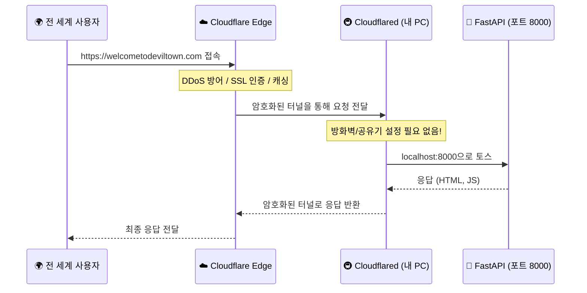

# MAINTENANCE.md - Devil Town 웹사이트 유지보수 가이드

## 📦 의존성 목록 및 버전

### Backend (Python)
- **FastAPI**: 0.104.0+
- **Google Generative AI**: 0.8.6
- **Python-dotenv**: 1.0.0
- **Uvicorn**: 0.24.0

### Frontend
- **Vanilla JS**: ES6+
- **CSS**: CSS3 (Modern features)
- **HTML**: HTML5 Semantic markers

---

## 🏗️ 시스템 아키텍처 및 터널링

### 작동 원리 (Cloudflare Tunnel)


---

## 🚀 배포 및 운영 절차

### 1. 환경 설정 (.env)
프로젝트 루트에 `.env` 파일을 생성하고 아래 형식을 따릅니다.
```env
GOOGLE_API_KEY=your_api_key_here
ICLOUD_CALENDAR_ICS_URL=https://p44-caldav.icloud.com/published/2/...
RATE_LIMIT_WINDOW_SECONDS=60
CHAT_RATE_LIMIT_PER_WINDOW=60
DICE_RATE_LIMIT_PER_WINDOW=120
CALENDAR_RATE_LIMIT_PER_WINDOW=30
MAX_CHAT_MESSAGE_LENGTH=500
MAX_CHAT_HISTORY_ITEMS=24
CALENDAR_CACHE_TTL_SECONDS=120
CORS_ALLOWED_ORIGINS=https://welcometodeviltown.com,https://www.welcometodeviltown.com
APP_VERSION=1.3.0
LOG_MAX_BYTES=5242880
LOG_BACKUP_COUNT=10
```

`APP_VERSION`가 없으면 `VERSION` 파일 값을 읽고, 둘 다 없으면 `dev`로 동작합니다.

### 2. Windows 프로덕션 서버 배포 (미니 PC)
1. **GitHub Pull**: 최신 코드를 내려받습니다.
   ```powershell
   git pull origin main
   ```
2. **서버 실행**: `start_server.bat`를 실행하거나 직접 명령어를 입력합니다.
   ```powershell
   python main.py
   ```
3. **터널 실행**: `cloudflared` 서비스가 실행 중인지 확인합니다.
   ```powershell
   Start-Service cloudflared
   ```

---

## 📊 로그 및 모니터링 (글로벌 룰 준수)

### 로그 확인 방법
- **위치**: `Logs/server.log`
- **표준 포맷**: `[Level] job_id=X step=Y status=Z duration_ms=N`
- **롤링 정책**: `LOG_MAX_BYTES` 초과 시 `server.log.1`, `server.log.2`로 분할, `LOG_BACKUP_COUNT`만큼 보관
- **응답 헤더 추적값**: `X-Request-ID`, `X-App-Version`

### ✅ 로그 점검 항목
- [ ] 모든 요청에 고유한 `job_id`가 부여되는가?
- [ ] 처리 단계별 `step`이 로그에 명시되는가?
- [ ] `duration_ms`를 통해 성능 저하를 감지할 수 있는가?
- [ ] 로그 파일이 비정상적으로 단일 파일로만 커지지 않는가?

### 버전 관리 점검 항목
- [ ] `VERSION` 파일과 `CHANGELOG.md`의 릴리즈 내역이 일치하는가?
- [ ] 배포 후 `GET /meta/version` 응답의 `app_version`이 기대값과 같은가?
- [ ] 이슈 제보 시 `X-Request-ID`를 함께 수집하는가?

---

## ⏮️ 롤백 및 장애 대응

### 1. Git 롤백
문제가 발생하면 마지막 안정 태그로 체크아웃해 핫픽스 브랜치를 따는 방식을 권장합니다.
```bash
git fetch --tags
git checkout tags/<stable-tag> -b hotfix/<date>-rollback
```

---

## 🔍 정기 점검 가이드
- **일간**: `Logs/server.log`의 ERROR 발생 여부 확인
- **주간**: Google Cloud Console에서 API 할당량(Quota) 확인
- **월간**: `pip list --outdated`로 보안 패치 대상 라이브러리 체크

## 📘 운영 문서 링크

- [`README.md`](README.md): 설치/실행 가이드
- [`SYSTEM_DOCS.md`](SYSTEM_DOCS.md): 아키텍처/API/트러블슈팅
- [`RUNBOOK.md`](RUNBOOK.md): 장애 대응 절차
- [`CHANGELOG.md`](CHANGELOG.md): 변경 이력

---

**마지막 업데이트**: 2026-02-16  
**문서 버전**: 1.6.0 (Rate Limit + Runbook 반영)
