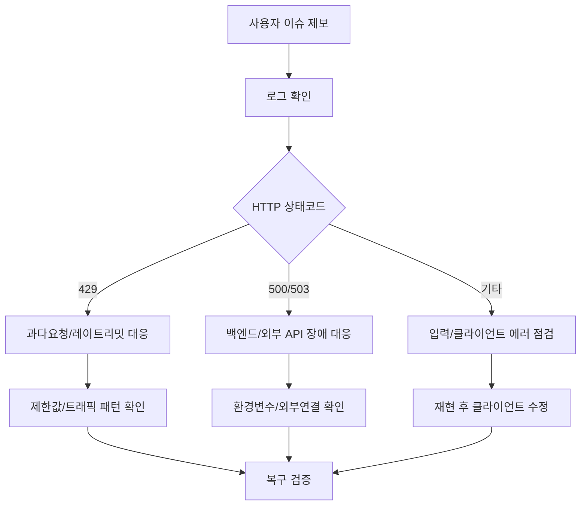

# RUNBOOK - Devil Town 운영/장애 대응 가이드

## 📚 목차
1. [개요](#개요)
2. [장애 대응 흐름](#장애-대응-흐름)
3. [공통 점검 절차](#공통-점검-절차)
4. [시나리오별 대응](#시나리오별-대응)
5. [복구 확인 체크리스트](#복구-확인-체크리스트)

---

## 개요

이 문서는 운영 중 발생하는 주요 이슈(429 과다요청, 캘린더 오류, AI 응답 실패, 포트 충돌)에 대해
빠르게 원인 파악 및 복구하기 위한 실행 절차를 정의합니다.

---

## 장애 대응 흐름



---

## 공통 점검 절차

1. 서버 프로세스 상태 확인
```bash
ps aux | rg "uvicorn|main.py"
```

2. 최근 에러 로그 확인
```bash
tail -n 200 Logs/server.log
```

3. 환경 변수 확인 (`.env`)
- `GOOGLE_API_KEY`
- `ICLOUD_CALENDAR_ICS_URL`
- `RATE_LIMIT_WINDOW_SECONDS`
- `CHAT_RATE_LIMIT_PER_WINDOW`
- `DICE_RATE_LIMIT_PER_WINDOW`
- `CALENDAR_RATE_LIMIT_PER_WINDOW`
- `APP_VERSION`
- `LOG_MAX_BYTES`
- `LOG_BACKUP_COUNT`

4. 버전 확인
```bash
curl -s http://localhost:8000/meta/version
```
응답 `app_version`이 기대 버전과 다르면, 실제 배포 산출물이 다른 상태일 수 있습니다.

---

## 시나리오별 대응

### 1) `/chat` 또는 `/dice-comment`에서 429 다발

증상:
- 프론트에서 "요청이 너무 많다. N초 후 다시 시도..." 문구 표시

조치:
1. `Logs/server.log`에서 `step=RATE_LIMIT` 빈도 확인
2. 특정 IP 집중 여부 확인
3. 필요 시 `.env` 상한 임시 상향 후 서버 재시작

```env
RATE_LIMIT_WINDOW_SECONDS=60
CHAT_RATE_LIMIT_PER_WINDOW=60
DICE_RATE_LIMIT_PER_WINDOW=120
```

주의:
- 완전 무제한은 금지. 봇 트래픽으로 비용/지연 급증 가능.

### 2) `/calendar/events` 503 발생

증상:
- 스케줄 섹션이 일정 로드 실패 상태 표시

조치:
1. `ICLOUD_CALENDAR_ICS_URL` 유효성 확인
2. 외부 네트워크 연결 확인
3. 캐시 만료 후 재시도 (`CALENDAR_CACHE_TTL_SECONDS` 확인)

### 3) `/chat` 500 발생

증상:
- 채팅에 서버 불안정 메시지 출력

조치:
1. `GOOGLE_API_KEY` 설정 확인
2. Gemini API quota/상태 확인
3. 입력 길이 제한 초과(413) 여부 확인

### 4) 포트 충돌 (`Address already in use`)

조치:
```bash
lsof -i :8000
kill -9 <PID>
python main.py
```

### 5) "배포했는데 화면은 바뀌었는데 API 동작이 예전 같다"

조치:
1. 브라우저 Network 탭에서 응답 헤더 `X-App-Version` 확인
2. 서버에서 `GET /meta/version` 확인
3. `VERSION` 파일, `.env`의 `APP_VERSION`, `CHANGELOG.md`가 일치하는지 확인
4. Cloudflare 캐시/브라우저 캐시 무효화 후 재검증

---

## 복구 확인 체크리스트

### ✅ 체크리스트
- [ ] `/chat` 정상 응답 확인
- [ ] `/dice-comment` 정상 응답 확인
- [ ] `/calendar/events` 정상 응답 확인
- [ ] `Logs/server.log`에 신규 ERROR 폭증 없음
- [ ] 사용자 화면에서 429/500 문구가 의도대로 표시되는지 확인
