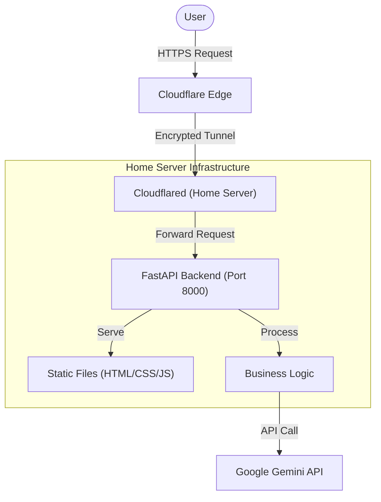

# DEVILTOWN WEBSITE - 시스템 전체 문서

## 📚 목차
1. [시스템 개요](#시스템-개요)
2. [아키텍처](#아키텍처)
3. [설치 및 설정](#설치-및-설정)
4. [사용 방법](#사용-방법)
5. [API 문서](#api-문서)
6. [페르소나 커스터마이징](#페르소나-커스터마이징)
7. [트러블슈팅](#트러블슈팅)
8. [유지보수](#유지보수)
9. [운영 런북](#운영-런북)

---

## 시스템 개요

### 프로젝트 목적
DevilTown 다크 테마 웹사이트를 운영하기 위한 구조/설정/운영 절차를 문서화합니다.  
이 사이트는 러닝, 음악, 그래픽 요소를 결합한 다크 테마 기반의 커뮤니티 공간이며, 다양한 인터랙티브 메뉴를 통해 콘텐츠를 제공합니다.

### 핵심 기능
- 🚪 **인트로 대문 (Error 666)**: "Bad gateway" 패러디 디자인으로 체크박스 인증 후 입장하는 게이트웨이 시스템
- 🗂️ **메뉴 기반 통합 콘텐츠**:
    - **Schedule**: iCloud 캘린더 연동 실시간 일정 정보 제공
    - **Archive**: 사진, 영상, 그래픽 실험물 등 시각적 아카이브
    - **Mixes**: DJ 믹스셋 및 플레이리스트 공유
    - **Marathoner**: 마라토너의 상세 정보 및 러닝 로그 기록
    - **Skull Dice**: 운명을 결정하는 주사위 게임 기반의 러닝 거리 추천
    - **Devil Coach**: "방구석여포" 페르소나를 가진 AI와의 인터랙티브 채팅
    - **WTFIS**: 로고, 티셔츠, 포스터 등 그래픽 실험 피드
- 🎨 **비주얼 시스템**: ASCII 아트, 노이즈, 글리치 효과 중심의 DevilTown 고유 테마

### 기술 스택
```
Frontend: HTML5 + CSS3 + Vanilla JavaScript
Backend: Python 3.8+ (FastAPI)
AI: Google Gemini 2.0 Flash
Server: Uvicorn (ASGI)
OS: macOS (Main Dev) & Windows 10 Home (Production Server)
```

---

## 아키텍처

### 시스템 구조도


### 서버 인프라 상세 정보

| 역할 | 기기 | OS | 사양 | 위치 | 프로젝트 경로 |
| :--- | :--- | :--- | :--- | :--- | :--- |
| **운영 (Production)** | 윈도우 미니 PC | Windows 10 Home | Intel Pentium G4600 / 16GB RAM | 홈 서버 | `D:\DEVILTOWN` |
| **개발 (Development)** | 맥북 프로 | macOS | M-Series / 16GB+ RAM | 로컬 개발 | `/Users/chaehyeonbyeongsin/Desktop/코딩/데빌타운 웹사이트` |

### 데이터 흐름
1. **정적 콘텐츠 서빙**: FastAPI가 `index.html`, `css`, `js` 파일을 브라우저에 전달
2. **동적 데이터 요청**: 프론트엔드(`navigation_feeds.js`)가 백엔드 API 호출
3. **일정 데이터 (Schedule)**: 백엔드가 iCloud ICS를 파싱하여 JSON으로 반환
4. **AI 채팅 (Devil Coach)**:
    - 사용자 입력 → `/chat` POST 요청
    - 백엔드 → Gemini API 호출 (시스템 프롬프트 + 요청에 포함된 최근 문맥)
    - 주의: 히스토리는 요청 처리용이며 서버에 사용자별 영구 저장하지 않음
    - AI 응답 → 프론트엔드에 전달 및 렌더링
5. **주사위 게임 (Skull Dice)**: 결과에 따른 맞춤형 코멘트를 AI가 생성하여 전달

---

## 설치 및 설정

### 1. 시스템 요구사항
- Python 3.8 이상
- pip (Python 패키지 관리자)
- 인터넷 연결 (Gemini API 호출용)
- Google Gemini API 키

### 2. 프로젝트 경로 및 설치

**Environment 1: macOS (Development)**
```bash
cd "/Users/chaehyeonbyeongsin/Desktop/코딩/데빌타운 웹사이트"
pip install -r requirements.txt
```

**Environment 2: Windows (Production Server)**
```powershell
cd "D:\DEVILTOWN"
pip install -r requirements.txt
# 또는 PowerShell 스크립트 실행
# .\setup_env.ps1
```

**설치되는 패키지**:
- `fastapi`: 웹 프레임워크
- `uvicorn`: ASGI 서버
- `google-generativeai`: Gemini API 클라이언트
- `python-dotenv`: 환경 변수 관리

### 3. API 키 설정
`.env` 파일을 생성하고 아래 값을 설정하세요:
```env
GOOGLE_API_KEY=your_actual_api_key_here
ICLOUD_CALENDAR_ICS_URL=https://p44-caldav.icloud.com/published/2/...
RATE_LIMIT_WINDOW_SECONDS=60
CHAT_RATE_LIMIT_PER_WINDOW=60
DICE_RATE_LIMIT_PER_WINDOW=120
CALENDAR_RATE_LIMIT_PER_WINDOW=30
MAX_CHAT_MESSAGE_LENGTH=500
MAX_CHAT_HISTORY_ITEMS=24
CALENDAR_CACHE_TTL_SECONDS=120
CORS_ALLOWED_ORIGINS=https://welcometodeviltown.com,https://www.welcometodeviltown.com
APP_VERSION=1.3.0
LOG_MAX_BYTES=5242880
LOG_BACKUP_COUNT=10
```

API 키는 [Google AI Studio](https://aistudio.google.com/)에서 발급받을 수 있습니다.

> ⚠️ **보안 주의**: `.env` 파일은 절대 Git에 커밋하지 마세요!

### 4. 서버 실행 방법

**macOS (Terminal)**:
```bash
uvicorn main:app --reload --host 0.0.0.0 --port 8000
```

**Windows (PowerShell)**:
```powershell
# 가상환경 활성화 (Optional)
.\venv\Scripts\Activate

# 서버 실행
python main.py
# 또는
uvicorn main:app --host 0.0.0.0 --port 8000
```

**실행 확인**:
```
INFO:     Started server process [12345]
INFO:     Waiting for application startup.
INFO:     Application startup complete.
INFO:     Uvicorn running on http://127.0.0.1:8000
```

### 5. 자동 실행 설정 (Windows)
PC가 켜질 때 서버를 자동으로 시작하려면 다음 단계를 수행하세요:

1. PowerShell을 관리자 권한으로 실행합니다.
2. 다음 명령어를 입력하여 자동 실행을 등록합니다:
   ```powershell
   cd "D:\DEVILTOWN"
   powershell -ExecutionPolicy Bypass -File setup_autostart.ps1
   ```
3. 이제 로그인 시 `start_server.bat`가 자동으로 실행됩니다.

---

## 사용 방법

### 웹 인터페이스 접속 및 메뉴 이용
1. 브라우저에서 `https://www.welcometodeviltown.com` 접속
2. 인트로 화면에서 체크박스 확인 후 **Enter** 클릭
3. 우측 상단 **MENU** 버튼을 클릭하여 원하는 메뉴 선택:
    - **Schedule**: 현재 진행 중이거나 예정된 세션 확인
    - **Archive**: 테마별 태그를 클릭하여 사진/영상 필터링
    - **Mixes**: Soundcloud나 YouTube 기반의 믹스셋 감상
    - **Skull Dice**: 주사위를 굴려 오늘 뛸 거리 정하기
    - **Devil Coach**: AI 코치에게 팩트 폭격 받으며 상담하기

### 콘텐츠 필터링 (Feed)
- Archive, Mixes 등 피드 섹션 상단의 **태그 버튼**을 클릭하여 관심 있는 카테고리만 골라 볼 수 있습니다.

### SKULL Dice 게임
1. **🎲 SKULL Dice** 메뉴 선택 또는 메인 화면의 버튼 클릭
2. 버튼 하단에서 주사위 결과와 AI 코치의 맞춤형 한마디 확인

### AI 채팅 (Devil Coach)
- 입력창에 질문이나 푸념을 입력하고 **Enter** 또는 **보내기** 클릭
- AI의 찰진 응답을 확인 (내용에 따라 2~5초 소요)
- 대화 문맥은 현재 페이지 세션 기준으로만 유지되며, 서버에 사용자별 대화 로그를 저장하지 않음

---

## API 문서

### POST /chat

**Endpoint**: `/chat`

**Request Body**:
```json
{
  "message": "오늘 춥네, 뛰기 싫은데?",
  "history": [
    {
      "role": "user",
      "content": "안녕"
    },
    {
      "role": "assistant",
      "content": "야 새끼야, 뭐 물어볼 거 있냐?"
    }
  ]
}
```

**참고**:
- `history`는 클라이언트가 요청마다 보내는 문맥 데이터입니다.
- 백엔드는 이를 sanitize 후 해당 요청 처리에만 사용하며, 사용자별 히스토리를 DB/파일에 영구 저장하지 않습니다.

**Response**:
```json
{
  "response": "쫄? ಠ_ಠ 날도 좋은데 쫄았네 쉐끼. 걍 뛰면 몸에서 용암 나옴ㅋㅋㅋ"
}
```

### POST /dice-comment

**Endpoint**: `/dice-comment`

**Request Body**:
```json
{
  "distance": "30km LSD"
}
```

**Response**:
```json
{
  "comment": "지옥주 시작이다! 30km LSD 실시! 토나올 때까지!"
}
```

### GET /calendar/events

**Endpoint**: `/calendar/events`

**Description**:
- 서버가 iCloud 공개 ICS를 조회/파싱해서 일정 목록을 JSON으로 반환합니다.
- 캘린더 API는 서버 측 캐시(`CALENDAR_CACHE_TTL_SECONDS`)를 사용합니다.

**Response**:
```json
{
  "source": "icloud",
  "count": 2,
  "events": [
    {
      "id": "event-1",
      "title": "DEVILTOWN SESSION",
      "start": "2026-02-20T19:00:00+09:00",
      "end": "2026-02-20T22:00:00+09:00",
      "all_day": false,
      "location": "Seoul",
      "notes": "",
      "categories": ["dj", "night"]
    }
  ]
}
```

### GET /meta/version

**Endpoint**: `/meta/version`

**Description**:
- 운영 점검용 버전/기동 메타 정보를 반환합니다.

**Response**:
```json
{
  "app_version": "1.3.0",
  "started_at": "2026-02-16T04:00:00+00:00",
  "log_file": "Logs/server.log"
}
```

### Rate Limit (공통)

- `POST /chat`: `CHAT_RATE_LIMIT_PER_WINDOW` 회 / `RATE_LIMIT_WINDOW_SECONDS` 초
- `POST /dice-comment`: `DICE_RATE_LIMIT_PER_WINDOW` 회 / `RATE_LIMIT_WINDOW_SECONDS` 초
- `GET /calendar/events`: `CALENDAR_RATE_LIMIT_PER_WINDOW` 회 / `RATE_LIMIT_WINDOW_SECONDS` 초

한도를 넘기면 `429 Too Many Requests`와 `Retry-After` 헤더를 반환합니다.

### Response Headers (운영 추적)

- `X-Request-ID`: 요청 단위 추적 ID (로그 `job_id`와 매핑)
- `X-App-Version`: 현재 실행 중인 백엔드 버전

---

## 트러블슈팅

### 문제 1: "API Key not configured" 에러
**원인**: `.env` 파일이 없거나 API 키가 잘못됨

**해결책**:
```bash
# .env 파일 확인 및 키 재설정
echo "GOOGLE_API_KEY=your_key_here" > .env
```

### 문제 2: 포트 충돌
**증상**: "Address already in use" 에러

**해결책**:
```bash
# Windows 포트 확인 및 종료
netstat -ano | findstr :8000
taskkill /PID <PID> /F
```

---

## 유지보수 (Maintenance)

### 1. 서버 코드 업데이트 (Git Pull)
최신 코드를 적용하려면 다음 명령어를 실행하세요:

**Windows**:
```powershell
cd D:\DEVILTOWN
git pull origin main
# 의존성 변경이 있다면
pip install -r requirements.txt
# 서버 재시작 (터널은 유지됨)
taskkill /F /IM python.exe
# (자동 실행 스크립트나 배치 파일로 다시 시작)
.\start_server.bat
```

### 2. 로그 확인
서버에 문제가 생겼을 때 가장 먼저 확인해야 할 파일입니다.
- **Windows**: `D:\DEVILTOWN\Logs\server.log`
- **실시간 확인**: PowerShell에서 `Get-Content D:\DEVILTOWN\Logs\server.log -Wait`

### 3. 정기 점검 체크리스트
- [ ] `git pull`로 최신 코드 유지
- [ ] `winget upgrade Cloudflare.cloudflared`로 터널 프로그램 업데이트
- [ ] `pip list --outdated`로 Python 패키지 최신화 여부 확인
- [ ] 로그 파일 용량이 너무 크지 않은지 확인 (필요시 삭제)

---

## 운영 런북

실시간 장애 대응 절차는 별도 문서에서 관리합니다.

- [`RUNBOOK.md`](RUNBOOK.md): 429/500/503/포트충돌 대응, 복구 체크리스트

### 파일 구조 상세

```
데빌타운 웹사이트/
├── main.py                    # FastAPI 백엔드 서버
│   ├── CORS 미들웨어
│   ├── /chat 엔드포인트
│   ├── /dice-comment 엔드포인트
│   └── Gemini API 통합
│
├── system_prompt.md           # AI 페르소나 정의
├── .env                       # 환경 변수 (API 키)
├── VERSION                    # 배포 버전 문자열
├── requirements.txt           # Python 의존성
├── SETUP_ENV.ps1              # [설치용] 환경 변수 및 파이썬 경로 자동 설정
├── setup_autostart.ps1        # [설치용] 윈도우 시작 시 자동 실행 등록 스크립트
├── start_server.bat           # [실행용] 서버와 터널을 한 번에 실행하는 배치 파일
├── cloudflared.exe            # [실행용] Cloudflare Tunnel 클라이언트 (단독 실행 파일)
├── README.md                  # 프로젝트 설명
├── SYSTEM_DOCS.md             # 시스템 전체 문서 (본 파일)
├── RUNBOOK.md                 # 운영/장애 대응 실행 가이드
│
├── index.html                 # 메인 HTML
│
├── css/
│   └── style.css              # 스타일시트
│
├── js/
│   ├── visuals.js             # 배경/ASCII/스크램블
│   ├── navigation_feeds.js    # 메뉴/모달/피드 렌더링
│   ├── game_video.js          # Dice/비디오 모달
│   ├── boot_gate.js           # 인트로/게이트 초기화
│   └── devil_coach_chat.js    # 채팅 로직
│
└── Logs/                      # 서버 로그 (Windows 전용)
    ├── server.log             # 현재 로그
    └── server.log.N           # 롤링 백업 로그
```

---

## 연락처 및 지원

문제가 발생하거나 개선 제안이 있으시면:
1. GitHub Issues 등록
2. 프로젝트 관리자에게 연락
3. `system_prompt.md` 직접 수정 후 PR
4. 걍 발바닥 벅벅 긁고 잠자기

**Happy Running! 🏃‍♂️💨**
