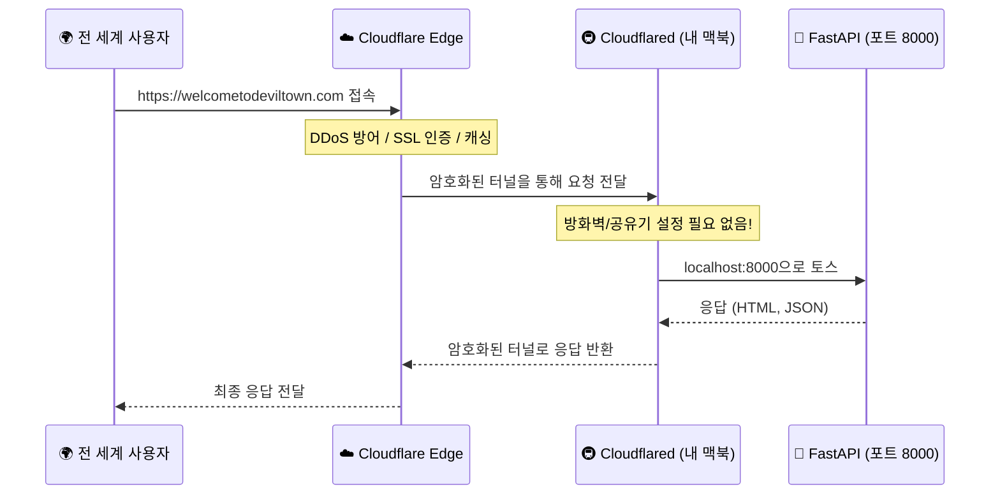

# Cloudflare Tunnel 가이드 & 관리 매뉴얼

## 🛠️ 작동 원리 (Architecture)



### 핵심 포인트
1.  **내 집이 서버다**: 외부 서버(AWS, DigitalOcean) 없이 내 컴퓨터가 직접 서비스를 제공합니다.
2.  **구멍낼 필요 없다**: 공유기 포트포워딩이나 방화벽 해제가 필요 없습니다. `cloudflared`가 안에서 밖으로 안전한 길(Tunnel)을 뚫기 때문입니다.
3.  **IP 노출 없음**: 내 집 IP가 전 세계에 노출되지 않고, Cloudflare IP만 보입니다. (보안 👍)

---

## ⚙️ 터널 관리 방법 (명령어)

### 1. 터널 실행 (서버 켜기)
```bash
# 터미널에서 실행 (이 창을 끄면 서버도 꺼짐)
cloudflared tunnel run deviltown
```

### 2. 백그라운드 실행 (창 꺼도 유지)
맥북이 켜져 있는 한 계속 돌아가게 하려면 서비스로 등록해야 합니다.

```bash
# 서비스 설치
sudo cloudflared service install

# 서비스 시작
sudo launchctl start com.cloudflare.cloudflared

# 서비스 상태 확인
sudo launchctl list | grep cloudflared
```

### 3. 설정 변경 (`config.yml`)
도메인을 추가하거나 포트를 바꾸고 싶을 때 수정합니다.
```bash
nano ~/.cloudflared/config.yml
```
수정 후엔 반드시 **재시작**해야 적용됩니다.

---

## 🖥️ Windows 터널 관리 (For Home Server)

Windows 미니 PC에서 터널을 관리하는 명령어입니다.

### 1. 서비스 상태 확인
```powershell
Get-Service cloudflared
```

### 2. 터널 재시작 (설정 변경 후)
config.yml을 수정한 경우 서비스를 재시작해야 합니다.
```powershell
Stop-Service cloudflared
Start-Service cloudflared
```

### 3. Cloudflared 업데이트
최신 버전으로 업데이트하려면:
```powershell
winget upgrade Cloudflare.cloudflared
```
업데이트 후 서비스를 재시작해주세요.

---

## ☁️ Cloudflare 대시보드 설정 체크리스트

웹사이트([dash.cloudflare.com](https://dash.cloudflare.com))에서 아래 설정을 꼭 확인하세요.

### 1. SSL/TLS (보안)
- [ ] **Overview** > **Encryption Mode**: **Full** 또는 **Full (strict)** 선택
    - *주의*: 이걸 `Off`나 `Flexible`로 하면 에러 날 수 있습니다.
- [ ] **Edge Certificates**: `Always Use HTTPS` **ON** (무조건 보안 접속)

### 2. Speed (속도)
- [ ] **Optimization** > **Auto Minify**: HTML, CSS, JS 모두 체크 **ON**
    - 파일 크기를 줄여서 로딩 속도를 높입니다.
- [ ] **Brotli**: **ON** (압축 전송)

### 3. Caching (캐싱)
- [ ] **Configuration** > **Caching Level**: **Standard**
- [ ] **Browser Cache TTL**: **4 hours** 또는 **1 day**

### 4. Security (WAF)
- [ ] **Settings** > **Security Level**: **Medium** (기본값)
- [ ] **Bot Fight Mode**: **ON** (나쁜 봇 차단)

---

## 🚨 트러블슈팅 (문제 해결)

### Q. 사이트가 안 들어가져요! (502 Bad Gateway)
1.  **내 맥북의 서버가 켜져 있나?**: `python main.py`가 실행 중인지 확인하세요.
2.  **터널이 켜져 있나?**: `cloudflared tunnel run deviltown`이 실행 중인지 확인하세요.
3.  **포트가 맞나?**: `config.yml`에 `localhost:8000`이 맞는지 확인하세요.

### Q. PC/맥북이 꺼지지 않게 하려면?
- **Windows**: 전원 옵션 > 절전 모드 해제
- **Mac**: 설정 > 디스플레이 > "디스플레이가 꺼져도 잠들지 않음" 체크

### Q. 터널이 자꾸 끊겨요!
- 와이파이가 불안정하면 그럴 수 있습니다. 가능하면 **유선 랜**을 꽂거나 와이파이 신호가 강한 곳에 두세요.
